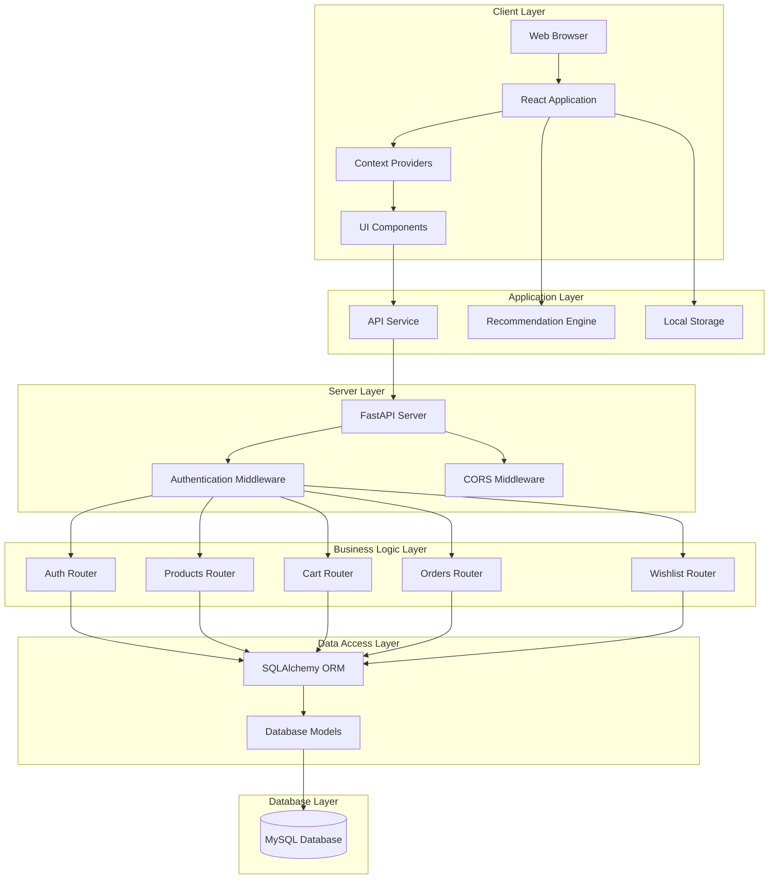
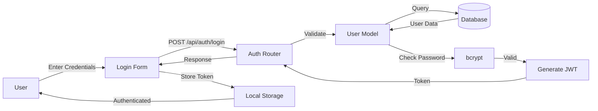
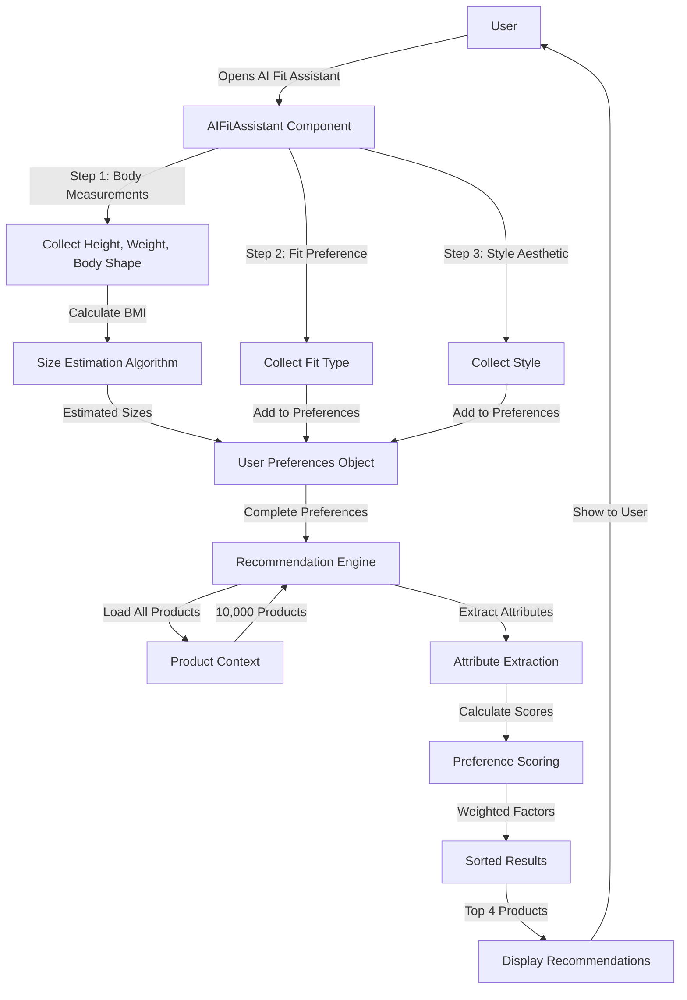
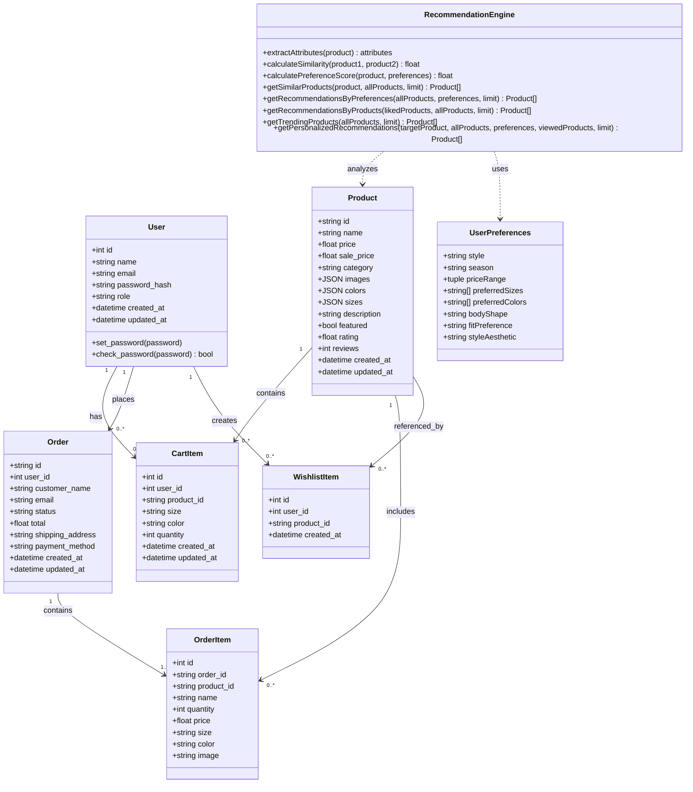
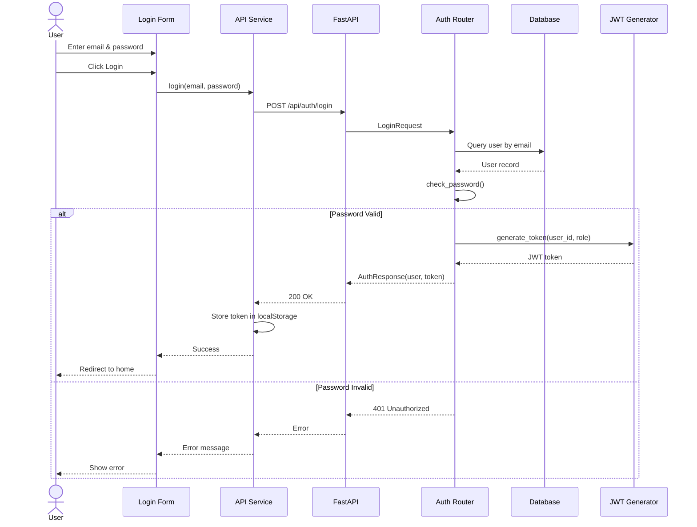
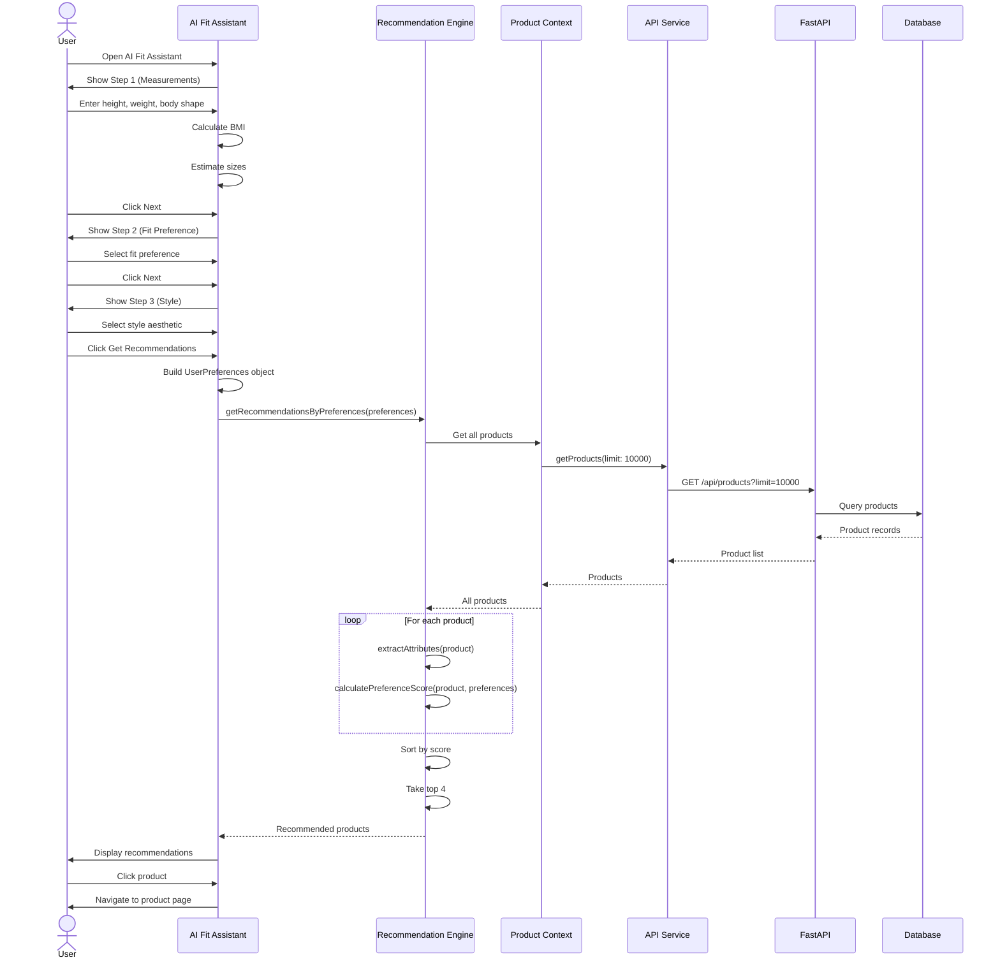
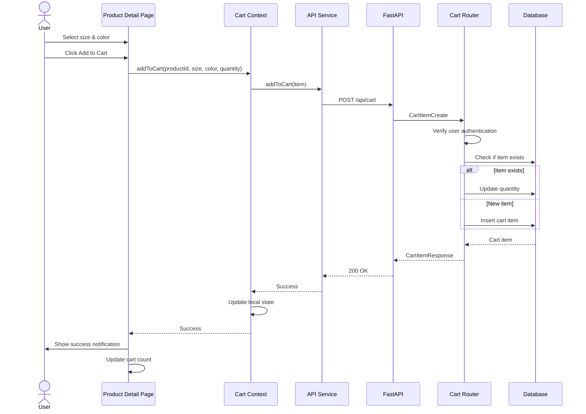
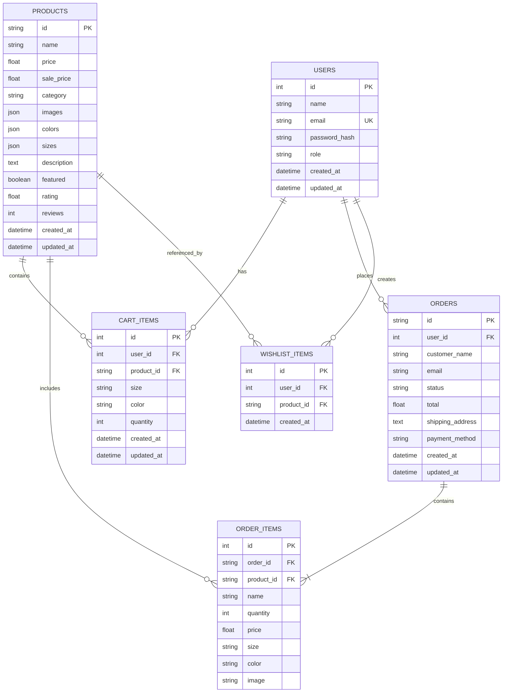

# Chapter 2: Analysis and Design

## 2.1 Introduction

This chapter presents a comprehensive analysis and design of the Fashion Website with AI Recommendation system. It covers the system requirements, stakeholder analysis, architectural design, data flow, use cases, class diagrams, design patterns, sequence diagrams, database design, and the technologies used to implement the solution.

The system is designed following modern software engineering principles, including separation of concerns, modularity, scalability, and maintainability. The architecture follows a client-server model with a React-based frontend and a FastAPI-based backend, communicating through RESTful APIs.

## 2.2 User and System Requirements

### 2.2.1 Functional Requirements

#### User Management (FR-UM)
- **FR-UM-01**: Users shall be able to register with name, email, and password
- **FR-UM-02**: Users shall be able to log in with email and password
- **FR-UM-03**: System shall support role-based access (User and Admin)
- **FR-UM-04**: Users shall be able to view and update their profile information
- **FR-UM-05**: System shall maintain user session using JWT tokens
- **FR-UM-06**: Passwords shall be hashed using bcrypt before storage

#### Product Management (FR-PM)
- **FR-PM-01**: System shall display products with images, name, price, category, sizes, and colors
- **FR-PM-02**: Users shall be able to browse products by category (Women, Men, Kids, Accessories)
- **FR-PM-03**: Users shall be able to view detailed product information
- **FR-PM-04**: Admins shall be able to create new products
- **FR-PM-05**: Admins shall be able to update existing products
- **FR-PM-06**: Admins shall be able to delete products
- **FR-PM-07**: System shall support product filtering by category, price, and attributes
- **FR-PM-08**: Products shall support multiple images, colors, and sizes

#### Shopping Cart (FR-SC)
- **FR-SC-01**: Users shall be able to add products to cart with selected size and color
- **FR-SC-02**: Users shall be able to update item quantities in cart
- **FR-SC-03**: Users shall be able to remove items from cart
- **FR-SC-04**: Users shall be able to clear entire cart
- **FR-SC-05**: System shall persist cart items in database for logged-in users
- **FR-SC-06**: Cart shall display total price and item count

#### Wishlist (FR-WL)
- **FR-WL-01**: Users shall be able to add products to wishlist
- **FR-WL-02**: Users shall be able to remove products from wishlist
- **FR-WL-03**: Users shall be able to view all wishlist items
- **FR-WL-04**: System shall prevent duplicate items in wishlist

#### Order Management (FR-OM)
- **FR-OM-01**: Users shall be able to place orders from cart items
- **FR-OM-02**: System shall generate unique order IDs
- **FR-OM-03**: Users shall be able to view order history
- **FR-OM-04**: Users shall be able to view order details
- **FR-OM-05**: Admins shall be able to view all orders
- **FR-OM-06**: Admins shall be able to update order status (Pending, Processing, Shipped, Delivered, Cancelled)
- **FR-OM-07**: Orders shall include customer information, items, total, and shipping address

#### AI Recommendations (FR-AI)
- **FR-AI-01**: System shall provide AI Fit Assistant with 3-step wizard
- **FR-AI-02**: System shall collect body measurements (height, weight, body shape)
- **FR-AI-03**: System shall calculate BMI and estimate appropriate sizes
- **FR-AI-04**: System shall collect fit preferences (slim, regular, relaxed, oversized)
- **FR-AI-05**: System shall collect style preferences (minimal, classic, modern, casual, elegant)
- **FR-AI-06**: System shall generate personalized recommendations based on preferences
- **FR-AI-07**: System shall provide similar product recommendations
- **FR-AI-08**: System shall track user browsing history for collaborative filtering
- **FR-AI-09**: System shall display trending products
- **FR-AI-10**: System shall extract product attributes from names and descriptions

### 2.2.2 Non-Functional Requirements

#### Performance (NFR-P)
- **NFR-P-01**: Product listing page shall load within 2 seconds
- **NFR-P-02**: API responses shall return within 500ms for 95% of requests
- **NFR-P-03**: System shall support up to 10,000 products without performance degradation
- **NFR-P-04**: Recommendation engine shall generate results within 1 second

#### Security (NFR-S)
- **NFR-S-01**: All passwords shall be hashed using bcrypt with salt
- **NFR-S-02**: Authentication shall use JWT tokens with expiration
- **NFR-S-03**: API shall implement CORS protection
- **NFR-S-04**: Admin endpoints shall require admin role verification
- **NFR-S-05**: SQL injection shall be prevented through ORM usage

#### Usability (NFR-U)
- **NFR-U-01**: Interface shall be responsive for mobile, tablet, and desktop
- **NFR-U-02**: UI shall follow modern design principles with consistent styling
- **NFR-U-03**: Error messages shall be clear and actionable
- **NFR-U-04**: Navigation shall be intuitive with maximum 3 clicks to any feature

#### Reliability (NFR-R)
- **NFR-R-01**: System shall have 99% uptime
- **NFR-R-02**: Database transactions shall be ACID-compliant
- **NFR-R-03**: System shall handle errors gracefully without crashes

#### Scalability (NFR-SC)
- **NFR-SC-01**: Architecture shall support horizontal scaling
- **NFR-SC-02**: Database shall support up to 100,000 users
- **NFR-SC-03**: System shall handle 1,000 concurrent users

#### Maintainability (NFR-M)
- **NFR-M-01**: Code shall follow TypeScript and Python best practices
- **NFR-M-02**: API shall be documented with OpenAPI/Swagger
- **NFR-M-03**: Components shall be modular and reusable
- **NFR-M-04**: Database schema shall support migrations

## 2.3 Stakeholders

### Primary Stakeholders

#### 1. End Users (Customers)
- **Role**: Browse and purchase fashion products
- **Interests**: Easy product discovery, accurate recommendations, smooth checkout
- **Requirements**: User-friendly interface, personalized experience, secure transactions

#### 2. System Administrators
- **Role**: Manage products, orders, and users
- **Interests**: Efficient management tools, comprehensive analytics
- **Requirements**: Admin dashboard, CRUD operations, order management

#### 3. Business Owners
- **Role**: Platform owners and decision-makers
- **Interests**: Increased sales, customer satisfaction, competitive advantage
- **Requirements**: Analytics, scalability, cost-effectiveness

### Secondary Stakeholders

#### 4. Developers
- **Role**: Build and maintain the system
- **Interests**: Clean architecture, good documentation, modern tech stack
- **Requirements**: Well-structured code, API documentation, development tools

#### 5. Database Administrators
- **Role**: Manage database infrastructure
- **Interests**: Data integrity, performance, backup/recovery
- **Requirements**: Optimized queries, proper indexing, migration support

## 2.4 System Design

### 2.4.1 Block Diagram & Data Flow Diagram

#### System Architecture Block Diagram

#### Data Flow Diagram - User Authentication

#### Data Flow Diagram - AI Recommendation Process

### 2.4.2 Use Cases

#### Use Case 1: User Registration and Login

**Actor**: Customer  
**Precondition**: User has internet access  
**Main Flow**:
1. User navigates to signup page
2. User enters name, email, and password
3. System validates input
4. System hashes password with bcrypt
5. System creates user record in database
6. System generates JWT token
7. System returns token and user data
8. User is redirected to home page

**Alternative Flow**:
- 3a. Email already exists → Show error message
- 3b. Invalid email format → Show validation error

**Postcondition**: User is authenticated and can access protected features

---

#### Use Case 2: Browse and Filter Products

**Actor**: Customer  
**Precondition**: None  
**Main Flow**:
1. User navigates to shop page
2. System loads all products from database
3. User selects category filter (e.g., Women)
4. System filters products by category
5. System displays filtered products in grid
6. User clicks on product
7. System navigates to product detail page

**Alternative Flow**:
- 3a. User applies price filter → System filters by price range
- 6a. No products found → Display "No products found" message

**Postcondition**: User views relevant products

---

#### Use Case 3: Add Product to Cart

**Actor**: Authenticated Customer  
**Precondition**: User is logged in  
**Main Flow**:
1. User views product detail page
2. User selects size and color
3. User clicks "Add to Cart"
4. System validates selection
5. System sends POST request to /api/cart
6. Backend creates cart item record
7. System updates cart context
8. System shows success notification
9. Cart icon updates with new count

**Alternative Flow**:
- 2a. Size/color not selected → Show validation error
- 6a. Product already in cart → Update quantity instead

**Postcondition**: Product is added to user's cart

---

#### Use Case 4: Use AI Fit Assistant

**Actor**: Customer  
**Precondition**: User is on the website  
**Main Flow**:
1. User clicks "AI Fit Assistant" button
2. System opens 3-step wizard dialog
3. **Step 1**: User enters height (cm), weight (kg), and body shape
4. System calculates BMI
5. System estimates preferred sizes (XS-XXL)
6. User clicks "Next"
7. **Step 2**: User selects fit preference (slim/regular/relaxed/oversized)
8. User clicks "Next"
9. **Step 3**: User selects style aesthetic (minimal/classic/modern/casual/elegant)
10. User clicks "Get Recommendations"
11. System creates UserPreferences object
12. System calls getRecommendationsByPreferences()
13. Recommendation engine loads all products
14. Engine extracts attributes from product data
15. Engine calculates preference scores for each product
16. Engine sorts products by score
17. System displays top 4 recommendations
18. User clicks on recommended product
19. System navigates to product detail page

**Alternative Flow**:
- 17a. No matching products → Show "Start Over" option
- 17b. Fewer than 4 matches → Show available matches

**Postcondition**: User receives personalized product recommendations

---

#### Use Case 5: Place Order

**Actor**: Authenticated Customer  
**Precondition**: User has items in cart  
**Main Flow**:
1. User navigates to cart page
2. User clicks "Proceed to Checkout"
3. System navigates to checkout page
4. User enters shipping address
5. User selects payment method
6. User reviews order summary
7. User clicks "Place Order"
8. System validates cart items
9. System generates unique order ID
10. System creates order record
11. System creates order items
12. System clears cart
13. System shows order confirmation
14. User views order in profile

**Alternative Flow**:
- 8a. Cart is empty → Redirect to shop
- 10a. Database error → Show error, keep cart intact

**Postcondition**: Order is placed and cart is cleared

---

#### Use Case 6: Admin Manages Products

**Actor**: Administrator  
**Precondition**: Admin is logged in  
**Main Flow**:
1. Admin navigates to admin dashboard
2. System verifies admin role
3. Admin clicks "Products" tab
4. System displays all products in table
5. Admin clicks "Add Product"
6. Admin enters product details (name, price, category, images, sizes, colors)
7. Admin clicks "Save"
8. System validates input
9. System sends POST to /api/products
10. Backend creates product record
11. System refreshes product list
12. New product appears in table

**Alternative Flow**:
- 5a. Admin clicks "Edit" on existing product → Update flow
- 5b. Admin clicks "Delete" → Confirmation dialog → Delete product
- 8a. Validation fails → Show error messages

**Postcondition**: Product is created/updated/deleted

### 2.4.3 Class Diagram

### 2.4.4 Design Patterns

#### 1. **Context Provider Pattern (React)**
- **Location**: `src/context/`
- **Purpose**: Centralized state management
- **Implementation**:
  - `AuthContext`: Manages user authentication state
  - `ProductContext`: Manages product data and recommendations
  - `CartContext`: Manages shopping cart state
  - `OrderContext`: Manages order state
  - `WishlistContext`: Manages wishlist state
- **Benefits**: Avoids prop drilling, provides global state access

#### 2. **Repository Pattern**
- **Location**: Backend routers and database layer
- **Purpose**: Abstracts data access logic
- **Implementation**: SQLAlchemy ORM models act as repositories
- **Benefits**: Decouples business logic from data access

#### 3. **Dependency Injection**
- **Location**: `backend/app/dependencies.py`
- **Purpose**: Provides database sessions and user authentication
- **Implementation**: FastAPI's dependency injection system
- **Benefits**: Testability, loose coupling

#### 4. **Strategy Pattern**
- **Location**: `src/utils/recommendationEngine.ts`
- **Purpose**: Multiple recommendation algorithms
- **Implementation**: Different functions for different recommendation strategies
  - Content-based filtering
  - Preference-based filtering
  - Collaborative filtering
  - Hybrid approach
- **Benefits**: Flexibility to switch algorithms

#### 5. **Facade Pattern**
- **Location**: `src/services/api.ts`
- **Purpose**: Simplified API interface
- **Implementation**: `apiService` object wraps all HTTP requests
- **Benefits**: Centralized API logic, easier to maintain

#### 6. **Observer Pattern**
- **Location**: React Context with hooks
- **Purpose**: Components react to state changes
- **Implementation**: Context consumers re-render on state updates
- **Benefits**: Reactive UI updates

#### 7. **Factory Pattern**
- **Location**: Backend models and schemas
- **Purpose**: Object creation
- **Implementation**: Pydantic schemas create validated objects
- **Benefits**: Validation, type safety

#### 8. **Middleware Pattern**
- **Location**: `backend/app/middleware.py`
- **Purpose**: Request/response processing
- **Implementation**: CORS middleware, authentication middleware
- **Benefits**: Cross-cutting concerns separation

### 2.4.5 Sequence Diagrams

#### Sequence Diagram: User Login

#### Sequence Diagram: AI Recommendation Generation

#### Sequence Diagram: Add to Cart

### 2.4.6 Database Design

#### Entity-Relationship Diagram

#### Database Schema Details

**Table: users**
- Primary Key: `id` (Auto-increment)
- Unique Key: `email`
- Indexes: `id`, `email`
- Constraints: `email` NOT NULL, `password_hash` NOT NULL

**Table: products**
- Primary Key: `id` (String, e.g., "PROD-001")
- Indexes: `id`
- JSON Fields: `images`, `colors`, `sizes`
- Constraints: `name` NOT NULL, `price` NOT NULL

**Table: cart_items**
- Primary Key: `id` (Auto-increment)
- Foreign Keys: `user_id` → users.id, `product_id` → products.id
- Cascade: DELETE on user/product deletion
- Constraints: `quantity` >= 1

**Table: orders**
- Primary Key: `id` (String, UUID format)
- Foreign Key: `user_id` → users.id
- Status Values: Pending, Processing, Shipped, Delivered, Cancelled
- Constraints: `total` >= 0

**Table: order_items**
- Primary Key: `id` (Auto-increment)
- Foreign Keys: `order_id` → orders.id, `product_id` → products.id
- Cascade: DELETE on order deletion
- Constraints: `quantity` >= 1, `price` >= 0

**Table: wishlist_items**
- Primary Key: `id` (Auto-increment)
- Foreign Keys: `user_id` → users.id, `product_id` → products.id
- Cascade: DELETE on user/product deletion
- Unique Constraint: (user_id, product_id) to prevent duplicates

## 2.5 Used Technologies and Tools

### Frontend Technologies

#### Core Framework
- **React 18.3.1**: Modern UI library with hooks and concurrent features
- **TypeScript**: Type-safe JavaScript for better development experience
- **Vite 6.3.5**: Fast build tool and development server

#### UI Libraries
- **Tailwind CSS**: Utility-first CSS framework for styling
- **Radix UI**: Accessible, unstyled component primitives
  - Dialog, Select, Label, Input, Button, Accordion, etc.
- **Lucide React**: Icon library
- **Motion (Framer Motion)**: Animation library
- **Sonner**: Toast notifications

#### State Management
- **React Context API**: Global state management
- **React Hooks**: useState, useEffect, useContext, custom hooks

#### Routing
- **React Router DOM**: Client-side routing

#### Additional Libraries
- **class-variance-authority**: CSS class management
- **clsx**: Conditional className utility
- **tailwind-merge**: Merge Tailwind classes intelligently

### Backend Technologies

#### Core Framework
- **FastAPI**: Modern, fast Python web framework
- **Python 3.8+**: Programming language
- **Uvicorn**: ASGI server

#### Database
- **MySQL 5.7+** / **MariaDB**: Relational database
- **SQLAlchemy**: ORM for database operations
- **PyMySQL**: MySQL driver for Python

#### Authentication & Security
- **JWT (JSON Web Tokens)**: Token-based authentication
- **bcrypt**: Password hashing
- **python-jose**: JWT encoding/decoding
- **passlib**: Password hashing utilities

#### Validation
- **Pydantic**: Data validation using Python type hints

#### CORS
- **FastAPI CORS Middleware**: Cross-Origin Resource Sharing

### Development Tools

#### Version Control
- **Git**: Source code management
- **GitHub**: Repository hosting

#### Package Management
- **npm**: Node package manager (frontend)
- **pip**: Python package manager (backend)

#### Code Quality
- **TypeScript Compiler**: Type checking
- **ESLint**: JavaScript/TypeScript linting (implicit)
- **Python type hints**: Static type checking

#### API Documentation
- **Swagger UI**: Interactive API documentation (FastAPI built-in)
- **ReDoc**: Alternative API documentation (FastAPI built-in)

### Deployment & Infrastructure

#### Environment Management
- **python-dotenv**: Environment variable management
- **.env files**: Configuration management

#### Database Management
- **init_db.py**: Database initialization script
- **SQLAlchemy migrations**: Schema versioning (potential)

### AI/ML Technologies

#### Recommendation Engine
- **Custom JavaScript/TypeScript**: Client-side recommendation algorithms
- **Content-based filtering**: Attribute extraction and similarity calculation
- **Collaborative filtering**: User behavior analysis
- **Hybrid approach**: Multiple algorithm combination

#### Algorithms Used
- **BMI Calculation**: Size estimation
- **Cosine Similarity**: Product similarity (conceptual)
- **Weighted Scoring**: Preference matching
- **Attribute Extraction**: NLP-like keyword matching

### Data Sources
- **SHEIN Product Dataset**: CSV files with product information
- **Custom Python scripts**: Data import and filtering

## 2.6 Summary

This chapter presented a comprehensive analysis and design of the Fashion Website with AI Recommendation system. Key takeaways include:

1. **Requirements**: The system has 40+ functional requirements covering user management, product management, shopping cart, wishlist, orders, and AI recommendations, along with 15+ non-functional requirements for performance, security, usability, reliability, scalability, and maintainability.

2. **Stakeholders**: Five main stakeholder groups were identified, including end users, administrators, business owners, developers, and database administrators, each with distinct needs and requirements.

3. **Architecture**: The system follows a modern layered architecture with clear separation between client, application, server, business logic, data access, and database layers.

4. **Design Patterns**: Eight design patterns are employed, including Context Provider, Repository, Dependency Injection, Strategy, Facade, Observer, Factory, and Middleware patterns.

5. **Use Cases**: Six detailed use cases demonstrate core functionality, from user registration to AI-powered recommendations.

6. **Database Design**: A well-normalized relational database with six tables supports all system features with proper relationships and constraints.

7. **Technology Stack**: Modern technologies including React 18, TypeScript, FastAPI, MySQL, and custom AI algorithms provide a robust foundation.

The design emphasizes modularity, scalability, security, and user experience, with particular focus on the innovative AI recommendation engine that sets this platform apart from traditional e-commerce solutions.

---

**Document Version**: 1.0  
**Last Updated**: December 2024  
**Project**: Fashion Website with AI Recommendation
